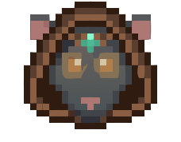

<h1 align="center">
  
</h1>

<p align="center">
  A local manuscript for video and audio.<br>
  A link or a file on the desk → a transcript → a Markdown summary with timestamps.<br>
  <strong>Electron + Python. No cloud APIs.</strong>
</p>

<p align="center">
  
  &nbsp; Chronicle
  &nbsp;&nbsp;·&nbsp;&nbsp;
  
  &nbsp; Inquisition
  &nbsp;&nbsp;·&nbsp;&nbsp;
  
  &nbsp; Ballad
</p>

---

## Three faces of the quill

The seal in the window header changes with the mode. The backend receives `summary_mode`.

<table>
  <tr>
    <td align="center" width="33%">
      <br><br>
      <strong>Chronicle</strong><br>
      <code>notes</code><br><br>
      A chronicle: overview, theses, terms, quotations, and a closing.
    </td>
    <td align="center" width="33%">
      <br><br>
      <strong>Inquisition</strong><br>
      <code>inquisition</code><br><br>
      The tribunal: an evaluation goal, required items, red flags, and a score.
    </td>
    <td align="center" width="33%">
      <br><br>
      <strong>Ballad</strong><br>
      <code>bard</code><br><br>
      A ballad of bright moments: focus, count, timestamps, and quotations.
    </td>
  </tr>
</table>

Prompts live in `backend/prompts/notes/`, `backend/prompts/inquisition/`, and `backend/prompts/bard/`. Other `summary_mode` values (`call_check`, `factcheck`, `tldr`) are available from the API — see [`backend/SUMMARY_MODES.md`](backend/SUMMARY_MODES.md).

---

## The path of the manuscript

```
Fetch  →  Distil  →  Scribe  →  Gloss  →  Limn
```

| In the window | Stage | What happens |
| --- | --- | --- |
| **Fetch** | `download` | yt-dlp pulls audio from a URL, or a local file is taken as-is |
| **Distil** | `extract` | ffmpeg turns the track into 16 kHz mono WAV |
| **Scribe** | `transcribe` | faster-whisper, Silero VAD |
| **Gloss** | `summarize` | a local GGUF model through llama.cpp |
| **Limn** | `format` | Markdown with timestamps, `*_summary.md` |

Transcription and summarization never keep their models in memory at the same time. A long recording is split into chunks: MAP across the pieces, then REDUCE into the final text.

---

## The Oracle

<p align="center">
  
</p>

<p align="center">
  <em>The Oracle</em> answers only from the manuscript in front of it:<br>
  this recording's transcript and summary, with timestamps. Other topics are refused.
</p>

When the chronicle is ready, the window offers “Talk to the Oracle”. The session is bound to that transcript-and-summary pair and does not mix with another video. Methods: `oracle_chat`, `oracle_cancel`, `oracle_close`.

---

## Getting started

You need **Python 3.10+**, **Node.js 18+**, and **ffmpeg** on `PATH`.

```bash
winget install ffmpeg   # Windows
brew install ffmpeg     # macOS
sudo apt install ffmpeg # Linux
```

```bash
npm install
pip install -r backend/requirements.txt
npm start
```

On the first run, Whisper and the LLM download themselves (about 1–2 GB).

1. Paste a link or lay down a local file.
2. Choose a Whisper codex and a language, or leave auto-detect on.
3. **Start Processing**.
4. Copy the text from the window, or open the finished `.md`.

---

## Rubrics

| Setting | Default | Options |
| --- | --- | --- |
| Whisper | `small` | tiny, base, small, medium, large-v3, large-v3-turbo |
| Reckoning | `auto` | auto, int8, float16, float32 |
| Language | auto | en, ru, ja, zh, de, fr, es, ko, and others |
| Oracle (LLM) | Qwen2.5-1.5B Q4_K_M | any GGUF from settings |
| GPU layers | all (`-1`) | partial offload, or CPU only |

Sources: a local video or audio file, YouTube, and the other sites [yt-dlp](https://github.com/yt-dlp/yt-dlp) can reach.

---

## How it is built

```
Electron (UI)  ←——  JSON-RPC over stdio  ——→  Python (backend/main.py)
```

| Layer | Where |
| --- | --- |
| Window | `electron/main.js`, `electron/preload.js`, `electron/renderer/` |
| Pipeline | `backend/pipeline.py` |
| Download | `backend/downloader.py` |
| Transcription | `backend/transcriber.py` — faster-whisper |
| Summary | `backend/summarizer.py` — llama-cpp-python |
| Oracle | `backend/oracle.py` |
| Markdown | `backend/formatter.py` |

This is not HTTP: one JSON line on stdin, replies and progress on stdout.

<details>
<summary><strong>Windows + NVIDIA: a CUDA wheel for llama-cpp-python</strong></summary>

<br>

`backend/requirements.txt` installs **llama-cpp-python** from PyPI. On Windows that wheel is CPU-only (`py3-none-win_amd64`), so summarization never touches the GPU until you replace it with a CUDA build.

The abetlen indexes mostly ship Linux wheels. Ready Windows CUDA builds are maintained by the community: [dougeeai/llama-cpp-python-wheels](https://github.com/dougeeai/llama-cpp-python-wheels/releases) (tags around **0.3.20**: `v0.3.20-cuda13.0-sm89` for Ada / RTX 40xx, `…-sm86` for Ampere / RTX 30xx, `…-sm75` for Turing / RTX 20xx).

```powershell
python -m pip install --force-reinstall --no-deps `
  "https://github.com/dougeeai/llama-cpp-python-wheels/releases/download/v0.3.20-cuda13.0-sm89/llama_cpp_python-0.3.20+cuda13.0.sm89.ada-py3-none-win_amd64.whl"
```

Check:

```powershell
python -c "import llama_cpp.llama_cpp as L; print('gpu offload:', L.llama_supports_gpu_offload())"
```

Wheel matrix and missing `cublas` DLLs: [`backend/requirements-llama-cuda.txt`](backend/requirements-llama-cuda.txt).  
Build from source (CUDA toolkit, MSVC, CMake): [`docs/WINDOWS_LLAMA_CPP_CUDA_SOURCE_BUILD.md`](docs/WINDOWS_LLAMA_CPP_CUDA_SOURCE_BUILD.md).

</details>

---

## Further shelves

| | |
| --- | --- |
| Overview in Russian | [`docs/PROJECT_OVERVIEW_RU.md`](docs/PROJECT_OVERVIEW_RU.md) |
| Map for people and models | [`llms.txt`](llms.txt) · [`docs/LLM_GUIDE.md`](docs/LLM_GUIDE.md) |
| Where to edit for a task | [`docs/LLM_TASK_MATRIX.md`](docs/LLM_TASK_MATRIX.md) · [`docs/CHANGE_PLAYBOOK.md`](docs/CHANGE_PLAYBOOK.md) |
| Backend and protocol | [`docs/LLM_BACKEND_REFERENCE.md`](docs/LLM_BACKEND_REFERENCE.md) · [`docs/IPC_PROTOCOL.md`](docs/IPC_PROTOCOL.md) |
| Function index | [`docs/FUNCTION_INDEX.md`](docs/FUNCTION_INDEX.md) |

## License

MIT
